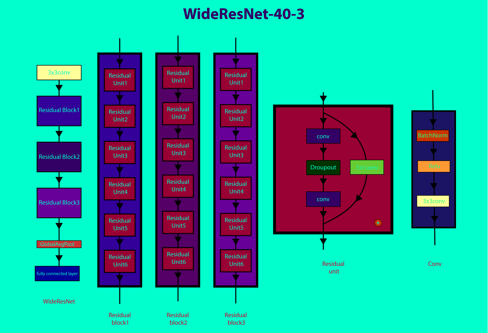

# Implementation of WideResnet (WRN-40-4) with Pytorch and TorchFusion
---
WRN-40-4 implementation of the paper [Wide Residual Networks](https://arxiv.org/pdf/1605.07146.pdf) in Pytorch and TorchFusion
# Architecture
---
WideResNet(Wide Residual Network) is a kind of deep learning architecture which tries to works on the limitations of ResNetV2 [Identity Mappings in Deep Residual Networks](https://arxiv.org/pdf/1603.05027.pdf). According to the paper:
> WRN mean wide residual networks, the number 40 stands for the amount of convolutional layers in the network and the number 4 represents the widening factor K. WRN-40-4 consist of residual units which is made by adding the input of the previous layer to the output of the next layer.All the chanels of the network are multiply the widening factor k execept the input chanel of the first convolutional layer. The first convolutional layer the residual network has a kernel size of 3, stride of 1 and a padding of 1. The output of this first convolutional layer is then passed to the first residual block. The first residual block is made up three residual units, and the size of it's input feature map of the first residual unit is equal to the size of the output feature map of the last residual unit in the first block. The next two residual blocks are consist of 3 residual units respective with the output feature maps of there last residual units equal half the input feature map of there first residual unit. The globalaveragepool the of the new output is computed then passed to the fully connected layer.

Wide Residual Networks prevents issues such as: <br>
1.) Diminishing Feature Reuse: This typically occurs in deep residual network in with the residual units are not learning enough useful features because there is nothing to force the gradients through the networks. <br>
2.) Training speed: Just like every deep neural networks, residual networks take very long time to train because they are have very large parameter that are difficult to compute with a GPU.



# Requirements
---
* Pytorch
* TorchFusion
* numpy
* PIL
* matplotlib
* Python


```python

```
